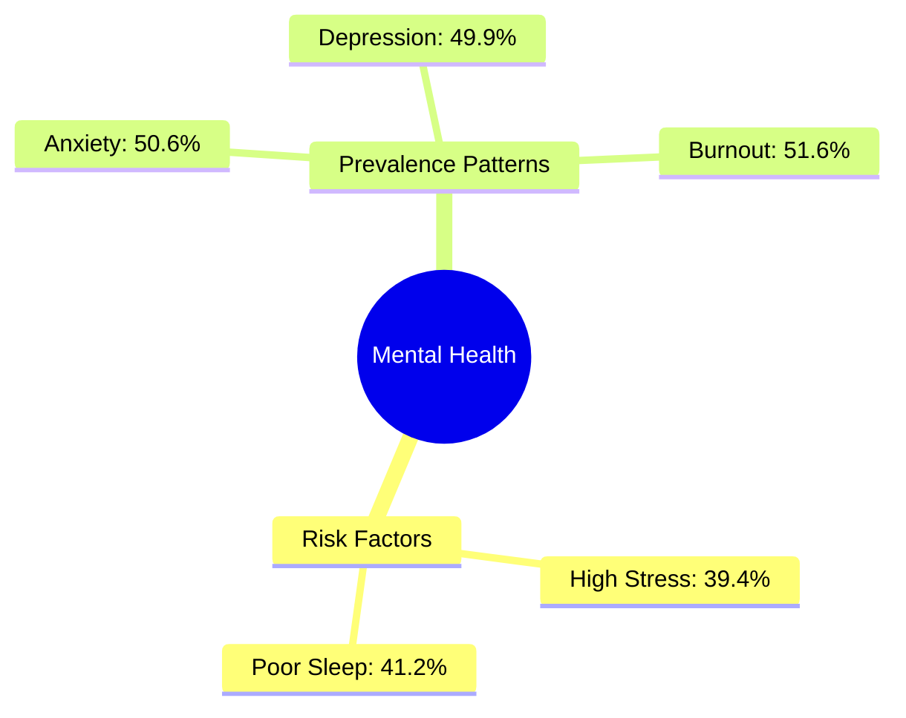

# 🧠 Mental Health Insights: A Data-Driven Analysis

**Mental health outcomes are driven by overlapping conditions — not isolated factors.**  
*A saúde mental é explicada pelo acúmulo de condições, não por fatores isolados.*

## 🚀 Key Takeaways & Implications / Conclusões e Implicações

- **Limited Scope of Isolated Fixes / Alcance Limitado de Ações Isoladas**: Addressing single factors like sleep or routine in isolation tends to have a diminishing return if the underlying accumulation of symptoms isn't addressed.
    - *PT: Intervenções focadas em fatores únicos (como apenas sono ou rotina) tendem a ter um retorno decrescente se o acúmulo de sintomas não for tratado como um conjunto.*
- **Targeted Risk Assessment / Identificação Estratégica de Risco**: Effective identification of high-risk groups must prioritize **factor combinations** (e.g., Age + Employment Status) rather than looking at variables in silos.
    - *PT: A identificação de grupos de risco deve priorizar a **combinação de fatores** (ex: Idade + Status Ocupacional), e não apenas variáveis isoladas.*

## 💡 What this project demonstrates
*This project goes beyond data processing; it showcases a core analytical mindset:*

- **Translation to Value**: Ability to translate raw data into executive-level, actionable insights.
- **Contextual Framing**: Focus on framing the problem (symptom overlap) rather than just listing metrics.
- **Strategic Communication**: Clear, bilingual communication of complex human behavior patterns.

--- 

---

### 🌐 Language Selection / Seleção de Idioma
**[🇺🇸 English](#-english-version) | [🇧🇷 Português](#-versão-em-português)**

---

## 🇺🇸 English Version

### 📌 Executive Summary
In a sample of **2,000 individuals**, mental health challenges do not manifest as isolated symptoms but as a **co-occurring cluster**. While **39.4%** report high stress levels (7-10 on the scale), the real story lies in the overlap: anxiety, depression, and burnout act as a synchronized trio that intensifies with stress.

> **Core Thesis:** Mental health outcomes in this dataset are not driven by isolated factors, but by the accumulation of overlapping conditions.

### 🎯 Key Analytical Questions Answered
- **Who faces the highest risk?** Young employed individuals (49.3%).
- **Isolation vs. Overlap?** Symptoms rarely occur alone; stress acts as a cluster trigger.
- **Key Distorting Factors?** Age and occupation are more significant than gender or isolated habits.
- **Dominant vs. Combined?** There is no single "smoking gun"; the impact emerges from combined factors.

### 📊 Key Findings
- **The "Stress Multiplier" Effect**: Among those with high stress, **65.8%** also face anxiety (compared to only 40.6% in the low-stress group).
- **The Burnout Crisis**: **62.8%** of high-stress individuals report burnout, versus 44.3% of the general sample.
- **Vulnerable Demographics**: **Young employed individuals** are the most pressured group, with **49.3%** recording high stress levels.

### 📉 Mental Health Landscape

### 🔍 Methodological Context
- **Sample Size**: 2,000 unique records.
- **Metric**: "High Stress" is a score of **7-10** on a 10-point scale.

---

## 🇧🇷 Versão em Português

### 📌 Resumo Executivo
A análise de uma amostra de **2.000 profissionais** revela que a saúde mental não responde a fatores isolados, mas a um **agrupamento de sintomas**. Embora **39,4%** registrem alto estresse (escala 7-10), o ponto central é a sobreposição: ansiedade, depressão e burnout formam um trio que ganha escala à medida que o estresse sobe.

> **Tese Central:** Os dados indicam que a saúde mental não é explicada por fatores isolados, mas pelo acúmulo de condições simultâneas.

### 🎯 Perguntas Analíticas Respondidas
- **Quem apresenta maior risco?** Jovens empregados (49,3%).
- **Isolamento ou Acúmulo?** O estresse ocorre quase sempre junto de outros sintomas.
- **Fatores de Distorção?** Idade e contexto profissional alteram drasticamente a distribuição.
- **Fator Dominante ou Combinado?** O efeito é multivariado; não existe uma causa única.

### 📊 Principais Descobertas
- **Efeito Multiplicador do Estresse**: Entre indivíduos com alto estresse, **65,8%** também apresentam ansiedade (contra 40,6% do restante da amostra).
- **Crise de Burnout**: **62,8%** do grupo sob forte estresse relata burnout.
- **Diferença Etária**: O alto estresse é mais comum entre jovens (**43,8%**), superando adultos e seniores.

---

## 🚀 How to Run / Como Rodar

1.  **Clone the repository / Clone o repositório**.
2.  **Download the Data / Baixe os Dados**: 
    - Create a Kaggle account and download the dataset from [Kaggle - Mental Health Survey](https://www.kaggle.com/datasets/jajidhasan/mental-health).
    - Place the downloaded CSV file inside the `/data` folder of this project.
    - *PT: Crie uma conta no Kaggle, baixe o CSV e coloque-o dentro da pasta `/data` do projeto.*
3.  **Install Dependencies / Instalação**: Run `pip install -r requirements.txt`.
4.  **Execute**: Open `notebooks/main.ipynb` in your preferred editor (Jupyter, VS Code) and run all cells.

---

### 🧠 Final Insight

This analysis shows that mental health risk emerges from interaction effects, not isolated variables.

