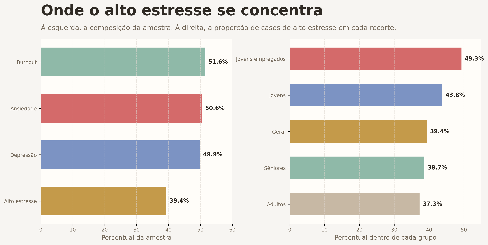

# Mental Health Kaggle

Em uma amostra de 2.000 pessoas, `39,4%` registram alto estresse (`7` a `10` na escala), mas o dado mais importante não é esse isoladamente. O ponto central é o acúmulo: ansiedade aparece em `50,6%` dos registros, depressão em `49,9%` e burnout em `51,6%`. Quando o estresse sobe, esses sinais sobem junto.

**O que mais importa nesta análise**

- Entre pessoas com alto estresse, `65,8%` também registram ansiedade. Entre as demais, esse percentual cai para `40,6%`.
- O mesmo padrão aparece em burnout: `62,8%` no grupo com alto estresse, contra `44,3%` no restante da amostra.
- A idade muda a leitura do problema. O percentual de alto estresse chega a `43,8%` entre jovens, acima de adultos (`37,3%`) e seniores (`38,7%`).
- O recorte mais pressionado da base é o de jovens empregados: `49,3%` deles estão na faixa de alto estresse.
- Sono importa, mas explica pouco sozinho. No quartil com menos horas de sono, `41,2%` estão em alto estresse; no quartil com mais sono, o percentual ainda é `37,0%`.

**Leitura executiva**

Os dados sugerem que saúde mental aqui se comporta menos como efeito de um hábito isolado e mais como uma combinação de contexto, fase de vida e sobreposição de sintomas. Por isso, o valor desta análise não está em buscar um único fator dominante, mas em mostrar onde os sinais se acumulam e onde o risco aparente ganha escala.

O recorte de gênero entra como contexto, não como disputa. A base está praticamente equilibrada entre mulheres (`50,4%`) e homens (`49,6%`), e a diferença geral em alto estresse é de `3,1 p.p.`. Isso é menor do que a variação observada entre faixas etárias e entre combinações de idade e ocupação.

As visualizações exportadas do projeto, geradas em [notebooks/main.ipynb](notebooks/main.ipynb), ficam em [output/figures](output/figures). Todos os números acima se referem a esta amostra.
