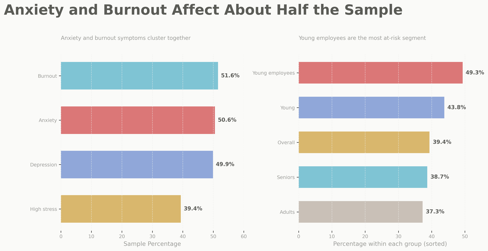
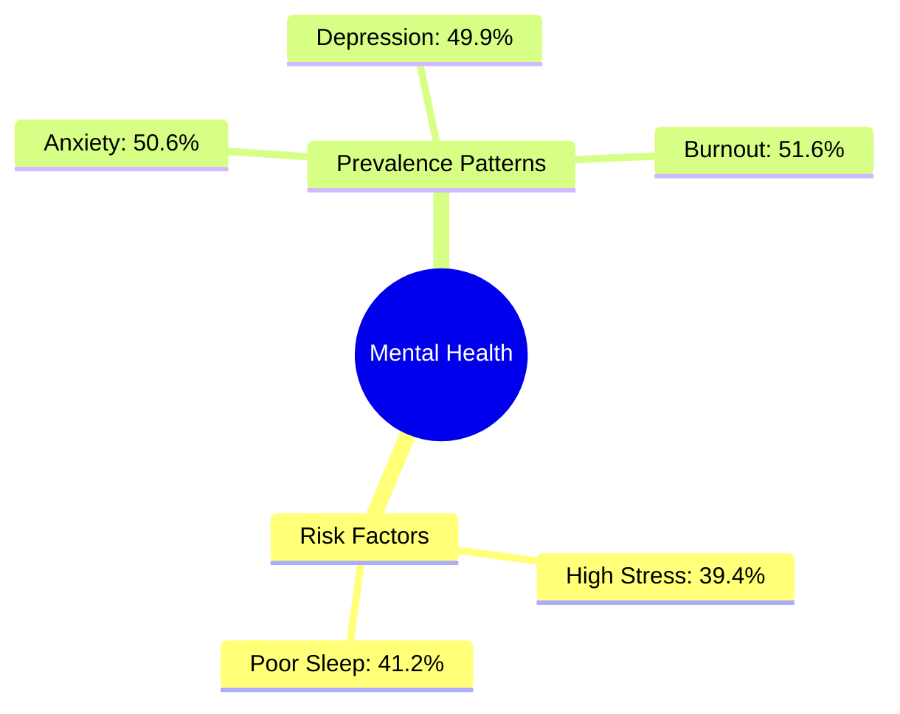

# Mental Health Insights: A Data-Driven Analysis

**Mental health outcomes are driven by overlapping conditions, not isolated factors.**  
*A saúde mental é explicada pelo acúmulo de condições, não por fatores isolados.*

## Key takeaways and implications / Conclusões e implicações

Addressing single factors like sleep or routine in isolation tends to have a diminishing return if the underlying accumulation of symptoms isn't addressed. Effective identification of high-risk groups also needs to prioritize factor combinations (e.g., age + employment status) rather than looking at variables in silos.

*PT: Intervenções focadas em fatores únicos (como apenas sono ou rotina) tendem a ter um retorno decrescente se o acúmulo de sintomas não for tratado como um conjunto. A identificação de grupos de risco deve priorizar a combinação de fatores (ex: idade + status ocupacional), e não apenas variáveis isoladas.*

## What this project demonstrates

Beyond the data processing itself, the project translates raw numbers into executive-level, actionable insights, frames the problem around symptom overlap instead of just listing metrics, and communicates complex human-behavior patterns clearly in two languages.

--- 

---

### Language / Idioma
**[English](#english-version) | [Português](#versão-em-português)**

---

## English version

### Executive summary
In a sample of 2,000 individuals, mental health challenges do not manifest as isolated symptoms but as a co-occurring cluster. While 39.4% report high stress levels (7-10 on the scale), anxiety, depression, and burnout tend to rise together as stress increases.

> **Core thesis:** Mental health outcomes in this dataset are not driven by isolated factors, but by the accumulation of overlapping conditions.

### Key analytical questions answered
- **Who faces the highest risk?** Young employed individuals (49.3%).
- **Isolation vs. Overlap?** Symptoms rarely occur alone; stress acts as a cluster trigger.
- **Key Distorting Factors?** Age and occupation are more significant than gender or isolated habits.
- **Dominant vs. Combined?** There is no single "smoking gun"; the impact emerges from combined factors.

### Key findings
Among those with high stress, **65.8%** also face anxiety, compared to **40.6%** in the low-stress group. **62.8%** of high-stress individuals report burnout, versus 44.3% of the general sample. Young employed individuals are the most pressured group, with **49.3%** recording high stress levels.

### Mental health picture

```mermaid
mindmap
  root((Mental Health))
    Risk Factors
      High Stress: 39.4%
      Poor Sleep: 41.2%
    Prevalence Patterns
      Anxiety: 50.6%
      Depression: 49.9%
      Burnout: 51.6%
```

### Methodological context
- **Sample Size**: 2,000 unique records.
- **Metric**: "High Stress" is a score of **7-10** on a 10-point scale.

---

## Versão em português

### Resumo executivo
A análise de uma amostra de 2.000 profissionais revela que a saúde mental não responde a fatores isolados, mas a um agrupamento de sintomas. Embora 39,4% registrem alto estresse (escala 7-10), ansiedade, depressão e burnout tendem a aumentar juntos à medida que o estresse sobe.

> **Tese central:** Os dados indicam que a saúde mental não é explicada por fatores isolados, mas pelo acúmulo de condições simultâneas.

### Perguntas analíticas respondidas
- **Quem apresenta maior risco?** Jovens empregados (49,3%).
- **Isolamento ou Acúmulo?** O estresse ocorre quase sempre junto de outros sintomas.
- **Fatores de Distorção?** Idade e contexto profissional alteram drasticamente a distribuição.
- **Fator Dominante ou Combinado?** O efeito é multivariado; não existe uma causa única.

### Principais descobertas
Entre indivíduos com alto estresse, **65,8%** também apresentam ansiedade, contra 40,6% do restante da amostra. **62,8%** do grupo sob forte estresse relata burnout. O alto estresse também é mais comum entre jovens (**43,8%**), superando adultos e seniores.

---

## How to run / Como rodar

1.  **Clone the repository / Clone o repositório**.
2.  **Download the Data / Baixe os Dados**: 
    - Create a Kaggle account and download the dataset from [Kaggle - Mental Health Survey](https://www.kaggle.com/datasets/jajidhasan/mental-health).
    - Place the downloaded CSV file inside the `/data` folder of this project.
    - *PT: Crie uma conta no Kaggle, baixe o CSV e coloque-o dentro da pasta `/data` do projeto.*
3.  **Install Dependencies / Instalação**: Run `pip install -r requirements.txt`.
4.  **Execute**: Open `notebooks/main.ipynb` in your preferred editor (Jupyter, VS Code) and run all cells.

---

### Final insight

This analysis shows that mental health risk emerges from interaction effects, not isolated variables.

## More analysis

- [Operational Efficiency vs Customer Value](https://github.com/matheusmarquezinhub/operational-efficiency-vs-customer-value)  
- [Revenue Data Storytelling](https://github.com/matheusmarquezinhub/revenue-data-storytelling)

